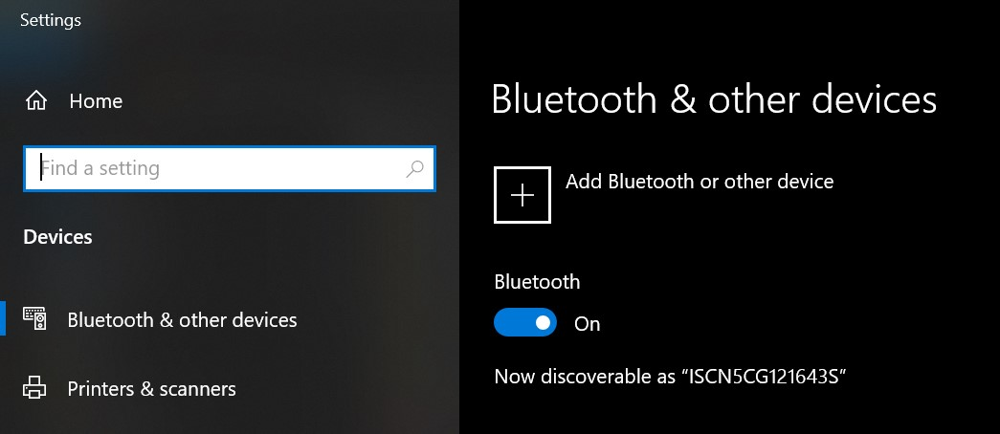
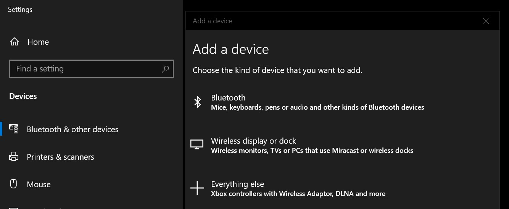
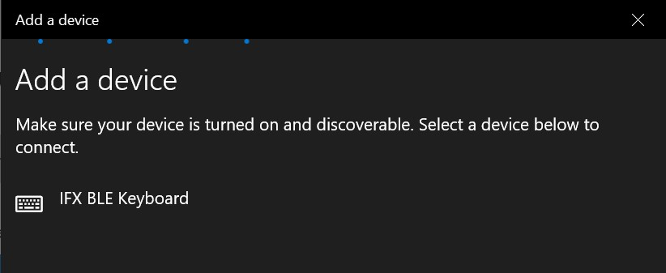
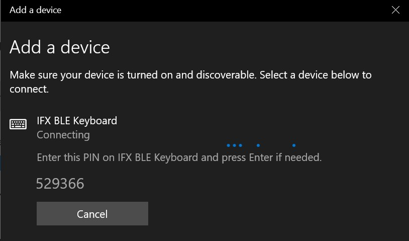
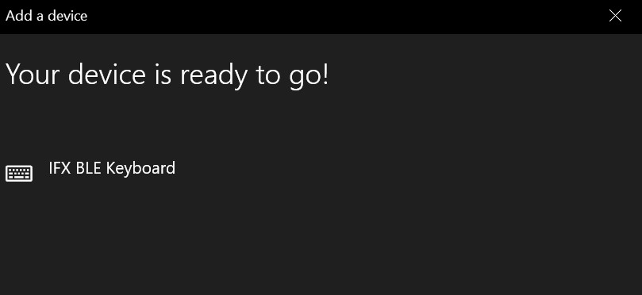

# AIROC&trade; CYW20829 HID keyboard reference solution

This reference solution demonstrates the implementation of the AIROC™ CYW20829 HID keyboard using the Infineon AIROC™ CYW20829 Bluetooth® LE MCU and ModusToolbox™ software environment.

[View this README on GitHub.](https://github.com/Infineon/mtb-example-btstack-freertos-cyw20829-keyboard)

[Provide feedback on this code example.](https://cypress.co1.qualtrics.com/jfe/form/SV_1NTns53sK2yiljn?Q_EED=eyJVbmlxdWUgRG9jIElkIjoiQ0UyMzY2MzciLCJTcGVjIE51bWJlciI6IjAwMi0zNjYzNyIsIkRvYyBUaXRsZSI6IkFJUk9DJnRyYWRlOyBDWVcyMDgyOSBISUQga2V5Ym9hcmQgc29sdXRpb24iLCJyaWQiOiJtYW5vaGFyYW5hbmIiLCJEb2MgdmVyc2lvbiI6IjEuMC4wIiwiRG9jIExhbmd1YWdlIjoiRW5nbGlzaCIsIkRvYyBEaXZpc2lvbiI6Ik1DRCIsIkRvYyBCVSI6IklDVyIsIkRvYyBGYW1pbHkiOiJCVEFCTEUifQ==)

## Requirements

- [ModusToolbox™ software](https://www.infineon.com/modustoolbox) v3.0
- Programming language: C
- Board support package (BSP): CYW920829-KEYBOARD
- Associated parts: [AIROC&trade; CYW20829 Bluetooth&reg; LE SoC](https://www.infineon.com/cms/en/product/promopages/airoc20829)
- [CY8CKIT-005 MiniProg 4](https://www.infineon.com/cms/en/product/evaluation-boards/cy8ckit-005/)

## Supported kits (make variable 'TARGET')

- [CYW20829 keyboard solution](https://www.infineon.com/cms/en/product/promopages/airoc20829/) (`CYW920829-KEYBOARD`) – Default value of `TARGET`

## Hardware setup

This example uses the kit’s default configuration. See the user guide to ensure that the kit is configured correctly.

## Using the code example

Create the project and open it using one of the following:

<details><summary><b>In Eclipse IDE for ModusToolbox&trade; software</b></summary>

1. Click the **New Application** link in the **Quick Panel** (or, use **File** > **New** > **ModusToolbox&trade; Application**). This launches the [Project Creator](https://www.infineon.com/ModusToolboxProjectCreator) tool.

2. Pick a kit supported by the code example from the list shown in the **Project Creator - Choose Board Support Package (BSP)** dialog. This kit should be AIROC&trade; LE CYW20829 Keyboard.

   When you select a supported kit, the example is reconfigured automatically to work with the kit. To work with a different supported kit later, use the [Library Manager](https://www.infineon.com/ModusToolboxLibraryManager) to choose the BSP for the supported kit. You can use the Library Manager to select or update the BSP and firmware libraries used in this application. To access the Library Manager, click the link from the **Quick Panel**.

   You can also just start the application creation process again and select a different kit.

   If you want to use the application for a kit not listed here, you may need to update the source files. If the kit does not have the required resources, the application may not work.

3. In the **Project Creator - Select Application** dialog, choose the example by enabling the checkbox.

4. (Optional) Change the suggested **New Application Name**.

5. The **Application(s) Root Path** defaults to the Eclipse workspace which is usually the desired location for the application. If you want to store the application in a different location, you can change the *Application(s) Root Path* value. Applications that share libraries should be in the same root path.

6. Click **Create** to complete the application creation process.

For more details, see the [Eclipse IDE for ModusToolbox&trade; software user guide](https://www.infineon.com/MTBEclipseIDEUserGuide) (locally available at *{ModusToolbox&trade; software install directory}/docs_{version}/mtb_ide_user_guide.pdf*).

</details>

<details><summary><b>In command-line interface (CLI)</b></summary>

ModusToolbox&trade; software provides the Project Creator as both a GUI tool and the command line tool, "project-creator-cli". The CLI tool can be used to create applications from a CLI terminal or from within batch files or shell scripts. This tool is available in the *{ModusToolbox&trade; software install directory}/tools_{version}/project-creator/* directory.

Use a CLI terminal to invoke the "project-creator-cli" tool. On Windows, use the command line "modus-shell" program provided in the ModusToolbox&trade; software installation instead of a standard Windows command-line application. This shell provides access to all ModusToolbox&trade; software tools. You can access it by typing `modus-shell` in the search box in the Windows menu. In Linux and macOS, you can use any terminal application.

The "project-creator-cli" tool has the following arguments:

Argument | Description | Required/optional
---------|-------------|-----------
`--board-id` | Defined in the `<id>` field of the [BSP](https://github.com/Infineon?q=bsp-manifest&type=&language=&sort=) manifest | Required
`--app-id`   | Defined in the `<id>` field of the [CE](https://github.com/Infineon?q=ce-manifest&type=&language=&sort=) manifest | Required
`--target-dir`| Specify the directory in which the application is to be created if you prefer not to use the default current working directory | Optional
`--user-app-name`| Specify the name of the application if you prefer to have a name other than the example's default name | Optional

<br />

The following example clones the "[mtb-example-btstack-freertos-cyw20829-keyboard](https://github.com/Infineon/mtb-example-btstack-freertos-cyw20829-keyboard)" application with the desired name "KeyboardSolution" configured for the *CYW920829-KEYBOARD* BSP into the specified working directory, *C:/mtb_projects*:

   ```
   project-creator-cli --board-id CYW920829-KEYBOARD --app-id mtb-example-btstack-freertos-cyw20829-keyboard --user-app-name KeyboardSolution --target-dir "C:/mtb_projects"
   ```

**Note:** The project-creator-cli tool uses the `git clone` and `make getlibs` commands to fetch the repository and import the required libraries. For details, see the "Project creator tools" section of the [ModusToolbox&trade; software user guide](https://www.infineon.com/ModusToolboxUserGuide) (locally available at *{ModusToolbox&trade; software install directory}/docs_{version}/mtb_user_guide.pdf*).

To work with a different supported kit later, use the [Library Manager](https://www.infineon.com/ModusToolboxLibraryManager) to choose the BSP for the supported kit. You can invoke the Library Manager GUI tool from the terminal using `make library-manager` command or use the Library Manager CLI tool "library-manager-cli" to change the BSP.

The "library-manager-cli" tool has the following arguments:

Argument | Description | Required/optional
---------|-------------|-----------
`--add-bsp-name` | Name of the BSP that should be added to the application | Required
`--set-active-bsp` | Name of the BSP that should be as active BSP for the application | Required
`--add-bsp-version`| Specify the version of the BSP that should be added to the application if you do not wish to use the latest from manifest | Optional
`--add-bsp-location`| Specify the location of the BSP (local/shared) if you prefer to add the BSP in a shared path | Optional

<br />

Following example adds the CYW920829-KEYBOARD BSP to the already created application and makes it the active BSP for the app:

   ```
   library-manager-cli --project "C:/mtb_projects/KeyboardSolution" --add-bsp-name CYW920829-KEYBOARD --add-bsp-version "latest-v4.X" --add-bsp-location "local"

   library-manager-cli --project "C:/mtb_projects/KeyboardSolution" --set-active-bsp APP_CYW920829-KEYBOARD
   ```

</details>

<details><summary><b>In third-party IDEs</b></summary>

Use one of the following options:

- **Use the standalone [Project Creator](https://www.infineon.com/ModusToolboxProjectCreator) tool:**

   1. Launch Project Creator from the Windows Start menu or from *{ModusToolbox&trade; software install directory}/tools_{version}/project-creator/project-creator.exe*.

   2. In the initial **Choose Board Support Package** screen, select the BSP, and click **Next**.

   3. In the **Select Application** screen, select the appropriate IDE from the **Target IDE** drop-down menu.

   4. Click **Create** and follow the instructions printed in the bottom pane to import or open the exported project in the respective IDE.

<br />

- **Use command-line interface (CLI):**

   1. Follow the instructions from the **In command-line interface (CLI)** section to create the application.

   2. Export the application to a supported IDE using the `make <ide>` command.

   3. Follow the instructions displayed in the terminal to create or import the application as an IDE project.

For a list of supported IDEs and more details, see the "Exporting to IDEs" section of the [ModusToolbox&trade; software user guide](https://www.infineon.com/ModusToolboxUserGuide) (locally available at *{ModusToolbox&trade; software install directory}/docs_{version}/mtb_user_guide.pdf*).

</details>


## Operation

1. Connect the board to your PC using the provided USB cable through the MiniProg4 USB connector.

2. Program the board using one of the following:

   <details><summary><b>Using Eclipse IDE for ModusToolbox&trade; software</b></summary>

      1. Select the application project in the Project Explorer.

      2. In the **Quick Panel**, scroll down, and click **\<Application Name> Program (KitProg3_MiniProg4)**.
   </details>

   <details><summary><b>Using CLI</b></summary>

     From the terminal, execute the `make program` command to build and program the application using the default toolchain to the default target. The default toolchain is specified in the application's Makefile but you can override this value manually:
      ```
      make program TOOLCHAIN=<toolchain>
      ```

      Example:
      ```
      make program TOOLCHAIN=GCC_ARM
      ```
   </details>

3. After programming, the application starts automatically. Confirm that the LED is ON for four seconds after programming.


## Debugging

This example requires additional steps to enable debugging. See the user guide to enable debugging.

You can debug the example to step through the code. In the IDE, use the **\<Application Name> Debug (KitProg3_MiniProg4)** configuration in the **Quick Panel**. For details, see the "Program and debug" section in the [Eclipse IDE for ModusToolbox&trade; software user guide](https://www.infineon.com/MTBEclipseIDEUserGuide).


## Design and implementation

### Steps to use the keyboard application

1. Use MTB or via command line to build and program your application.

2. The HID keyboard starts advertising as "IFX BLE Keyboard" at high duty for 60 seconds followed by low duty for 30 seconds, and then the advertisements are turned OFF.

3. When the advertisements are OFF, press connect button or any key on the keyboard to start advertisements and get them discovered by peer devices.

4. After the keyboard is connected to the host and kept idle for more than 10 minutes, it disconnects from the host and moves to a deepsleep state to save battery life.
The keyboard will come out of this deepsleep state on any button press events and start Bluetooth&reg; LE advertisement to get discovered and attempt to connect to the host device again.

5. When battery capacity is less than 10 percent, the keyboard gives a low battery alert by blinking the led ON for 500 ms and OFF for 3 seconds.

6. When the battery capacity reaches 1 percent, the keyboard goes to hibernate mode. To come out of this hibernate state, remove the batteries and insert new batteries to power cycle the keyboard.

**Note**: Power cycle the device after programming in order to enter the DS-RAM power mode.

### Steps to enable OTA 
Refer [OTA_README](./app_bt_ota/OTA_README.md)

### Testing on Windows 10

1. Use the slider switch at the bottom side to power ON the keyboard.

2. To pair the keyboard with a new host device, press and hold the connect button next to the slider switch for three seconds to start the undirected Bluetooth&reg; LE advertisement. Alternatively, press and hold the Fn key + Num 1/2/3 to start the undirected Bluetooth&reg; LE advertisement.

3. Navigate to Windows 10 Settings and click on **Devices** as shown below. <br/>



4. Click on **Add Bluetooth or Other device**. Ensure your device is advertising at this time. <br/>


5. **IFX BLE Keyboard** will be listed in the device discovery. After you click on the device, Windows initiates pairing and connection. <br/>


6. Displays a random 6-digit PIN, which the user has to enter on the keyboard. After successful authentication, Windows shows a notification that **Windows is setting up a device**. Windows takes a few seconds to exchange link keys. <br/>


7. After connecting, displays the following notification on Windows. <br/>


You can now use the keyboard to press keys and use all the functionalities.
The keyboard can be used in three OS modes- Android, Windows, and iOS.

### Testing on Android

1.  Use the slider switch at the bottom side to power ON the keyboard.

2. To pair the keyboard with a new host device, disconnect the keyboard from the current host device if connected to any. Then press and hold the connect button next to the slider switch for 3 seconds to start the undirected Bluetooth&reg; LE advertisement.

3. Navigate to Bluetooth&reg; in Settings. Scan for Bluetooth&reg; devices

4. "IFX BLE Keyboard" will be listed under available devices. Tap on it to initiate a pairing request. Displays a random 6-digit passkey, which the user has to enter on the IFX keyboard. After successful authentication, the keyboard will be ready to use.

### Testing on iOS

1. Use the slider switch at the bottom side to power ON the keyboard.

2. To pair the keyboard with a new host device, disconnect the keyboard from the current host device if connected to any. Then press and hold the connect button next to the slider switch for 3 seconds to start the undirected Bluetooth&reg; LE advertisement.

3. To enable external HID devices to function, users need to enable *Assistive Touch* from Accessibility settings.

4. Navigate to Bluetooth&reg; in Settings. Scan for Bluetooth&reg; devices. "IFX Keyboard" will be listed under available devices. Tap on it to initiate a pairing request. Displays a random 6-digit passkey, which the user has to enter on the IFX keyboard. After successful authentication, the keyboard will be ready to use.

### Switching host devices

1. The keyboard supports switching three host devices. This can be switched as follows.

   Fn Key + Key 1 -> Device 1

   Fn Key + Key 2 -> Device 2

   Fn Key + Key 3 -> Device 3

To switch to a different host device, press the Fn key + Numeric key 1/2/3.

2. The keyboard will start discoverable mode undirected advertisement if no previous host is connected to the selected channel.

3. The keyboard will start connectable mode undirected advertisement if a previous host device was paired already in the selected channel.

4. To change the current channel to a new host, press and hold the Connect button for 3 seconds. This starts undirected advertisement and a new host device can be paired to the selected channel.

5. Alternatively, press the Fn key + Numeric key 1/2/3 and hold for 3 seconds to start the undirected advertisement on the channel.

### Switching OS mode

1. The keyboard provides an option to switch its mode to iOS/Android/Windows. Depending on the mode selected, the functionality of Fn keys varies as shown in the following table.

 Key | Fn + on iOS       | Fn + on Android   | Fn + on Windows
 --- | ----------------- | ----------------- | ----------------
 ESC | Home              | Home              | Browser
 F1  | Brightness down   | Return            | Return
 F2  | Brightness up     | Email             | Email
 F3  | Virtual keyboard  | Menu              | Right-click
 F4  | Screen capture    | Media player      | Media player
 F5  | Search            | Search            | Search
 F6  | Language exchange | Language exchange | Language exchange
 F7  | Previous track    | Previous track    | Previous track
 F8  | Play/pause        | Play/pause        | Play/pause
 F9  | Next track        | Next track        | Next track
 F10 | Mute              | Mute              | Mute
 F11 | Volume down       | Volume down       | Volume down
 F12 | Volume up         | Volume up         | Volume up
 Del | Screen lock       | Screen lock       | Screen lock


2. The OS mode is changed by the following key combinations.

   Fn Key + Q -> iOS

   Fn Key + W -> Android

   Fn Key + E -> Windows


## Resources and settings

This section explains the ModusToolbox&trade; software resources and their configuration as used in this code example. Note that all the configuration explained in this section has already been done in the code example. ModusToolbox&trade; software stores the configuration settings of the application in the *design.modus* file. This file is used by the graphical configurators, which generate the configuration firmware. This firmware is stored in the application’s *GeneratedSource* folder.

- **Device Configurator:** Use this tool to enable/configure the peripherals and pins used in the application. See the [ModusToolbox&trade; Device Configurator user guide](https://www.infineon.com/ModusToolboxDeviceConfig).

- **Bluetooth Configurator:** Use this tool to generate/modify the Bluetooth&reg; LE GATT database. See the [ModusToolbox&trade; Bluetooth&reg; Configurator user guide](https://www.infineon.com/ModusToolboxBLEConfig).

## Related resources


Resources  | Links
-----------|----------------------------------
Development kits | Select your kits from the [Evaluation board finder](https://www.infineon.com/cms/en/design-support/finder-selection-tools/product-finder/evaluation-board) page
Tools  | [Eclipse IDE for ModusToolbox&trade; software](https://www.infineon.com/modustoolbox) – ModusToolbox&trade; software is a collection of easy-to-use software and tools enabling rapid development with Infineon MCUs, covering applications from embedded sense and control to wireless and cloud-connected systems using AIROC&trade; Wi-Fi and Bluetooth® connectivity devices. 

<br>

## Other resources


Infineon provides a wealth of data at www.infineon.com to help you select the right device, and quickly and effectively integrate it into your design.

## Document history


Document title: *CE236637* - *AIROC&trade; CYW20829 HID keyboard reference solution*

 Version | Description of change
 ------- | ---------------------
 1.0.0   | Beta Release of the keyboard application. This version is not for production
 2.0.0   | Added Support for CYW20829B0
 3.0.0   | OTA feature enabled.
 3.0.1   | Code optimization for OTA.
 3.1.0   | Bug Fixes.

<br />

---------------------------------------------------------

© Cypress Semiconductor Corporation, 2022. This document is the property of Cypress Semiconductor Corporation, an Infineon Technologies company, and its affiliates ("Cypress").  This document, including any software or firmware included or referenced in this document ("Software"), is owned by Cypress under the intellectual property laws and treaties of the United States and other countries worldwide.  Cypress reserves all rights under such laws and treaties and does not, except as specifically stated in this paragraph, grant any license under its patents, copyrights, trademarks, or other intellectual property rights.  If the Software is not accompanied by a license agreement and you do not otherwise have a written agreement with Cypress governing the use of the Software, then Cypress hereby grants you a personal, non-exclusive, nontransferable license (without the right to sublicense) (1) under its copyright rights in the Software (a) for Software provided in source code form, to modify and reproduce the Software solely for use with Cypress hardware products, only internally within your organization, and (b) to distribute the Software in binary code form externally to end users (either directly or indirectly through resellers and distributors), solely for use on Cypress hardware product units, and (2) under those claims of Cypress’s patents that are infringed by the Software (as provided by Cypress, unmodified) to make, use, distribute, and import the Software solely for use with Cypress hardware products.  Any other use, reproduction, modification, translation, or compilation of the Software is prohibited.
<br />
TO THE EXTENT PERMITTED BY APPLICABLE LAW, CYPRESS MAKES NO WARRANTY OF ANY KIND, EXPRESS OR IMPLIED, WITH REGARD TO THIS DOCUMENT OR ANY SOFTWARE OR ACCOMPANYING HARDWARE, INCLUDING, BUT NOT LIMITED TO, THE IMPLIED WARRANTIES OF MERCHANTABILITY AND FITNESS FOR A PARTICULAR PURPOSE.  No computing device can be absolutely secure.  Therefore, despite security measures implemented in Cypress hardware or software products, Cypress shall have no liability arising out of any security breach, such as unauthorized access to or use of a Cypress product. CYPRESS DOES NOT REPRESENT, WARRANT, OR GUARANTEE THAT CYPRESS PRODUCTS, OR SYSTEMS CREATED USING CYPRESS PRODUCTS, WILL BE FREE FROM CORRUPTION, ATTACK, VIRUSES, INTERFERENCE, HACKING, DATA LOSS OR THEFT, OR OTHER SECURITY INTRUSION (collectively, "Security Breach").  Cypress disclaims any liability relating to any Security Breach, and you shall and hereby do release Cypress from any claim, damage, or other liability arising from any Security Breach.  In addition, the products described in these materials may contain design defects or errors known as errata which may cause the product to deviate from published specifications. To the extent permitted by applicable law, Cypress reserves the right to make changes to this document without further notice. Cypress does not assume any liability arising out of the application or use of any product or circuit described in this document. Any information provided in this document, including any sample design information or programming code, is provided only for reference purposes.  It is the responsibility of the user of this document to properly design, program, and test the functionality and safety of any application made of this information and any resulting product.  "High-Risk Device" means any device or system whose failure could cause personal injury, death, or property damage.  Examples of High-Risk Devices are weapons, nuclear installations, surgical implants, and other medical devices.  "Critical Component" means any component of a High-Risk Device whose failure to perform can be reasonably expected to cause, directly or indirectly, the failure of the High-Risk Device, or to affect its safety or effectiveness.  Cypress is not liable, in whole or in part, and you shall and hereby do release Cypress from any claim, damage, or other liability arising from any use of a Cypress product as a Critical Component in a High-Risk Device. You shall indemnify and hold Cypress, including its affiliates, and its directors, officers, employees, agents, distributors, and assigns harmless from and against all claims, costs, damages, and expenses, arising out of any claim, including claims for product liability, personal injury or death, or property damage arising from any use of a Cypress product as a Critical Component in a High-Risk Device. Cypress products are not intended or authorized for use as a Critical Component in any High-Risk Device except to the limited extent that (i) Cypress’s published data sheet for the product explicitly states Cypress has qualified the product for use in a specific High-Risk Device, or (ii) Cypress has given you advance written authorization to use the product as a Critical Component in the specific High-Risk Device and you have signed a separate indemnification agreement.
<br />
Cypress, the Cypress logo, and combinations thereof, WICED, ModusToolbox, PSoC, CapSense, EZ-USB, F-RAM, and Traveo are trademarks or registered trademarks of Cypress or a subsidiary of Cypress in the United States or in other countries. For a more complete list of Cypress trademarks, visit www.infineon.com. Other names and brands may be claimed as property of their respective owners.
