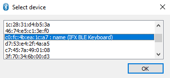
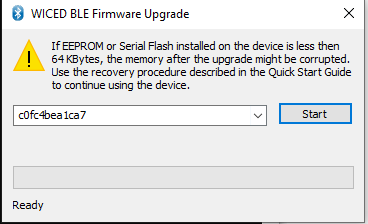
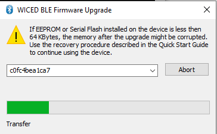
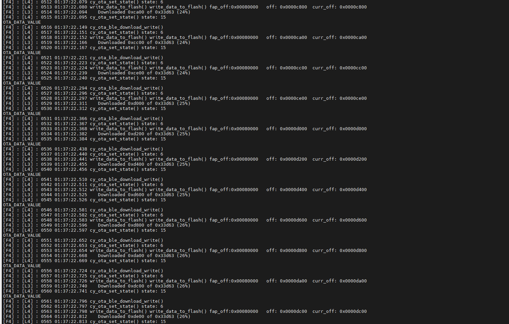
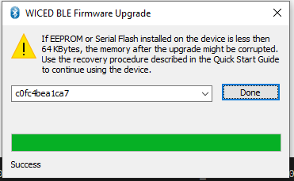
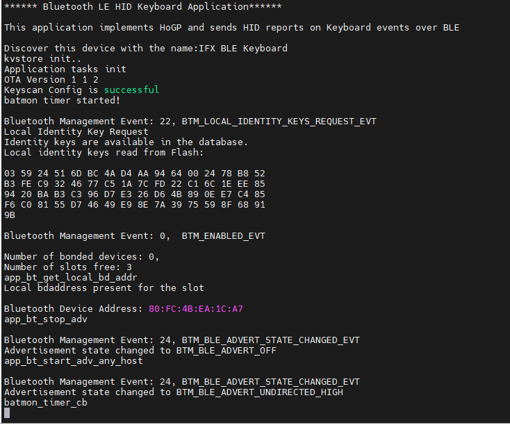

# AIROC&trade; CYW20829 HID keyboard reference solution

The HID Keyboard Application also support the Over The Air update feature.

## Steps to enable the OTA on the Key board
The MCUBOOT application must built and programmed separately.

### Steps to Create the MCUBOOT Application

1. Open a CLI terminal and run the following command:
   ```
   git clone https://github.com/JuulLabs-OSS/mcuboot.git
   ```
2. Navigate to the cloned mcuboot folder:
   ```
   cd mcuboot
   ```
3. Change the branch to get the appropriate version:
   ```
   git checkout v1.8.4-cypress
   ```
4. Pull in sub-modules to build mcuboot:
   ```
   git submodule update --init --recursive
   ```
5. Install the required Python packages mentioned in mcuboot/scripts/requirements.txt. Please see the ModusToolbox User Guide for information on CY_PYTHON_PATH environment variable usage:
   ```
   cd mcuboot/scripts
   pip install -r requirements.txt
   ```
### NOTE
Check the cysecuretools vesrion it must be version 4.2.0 or above for the CYW20829

   Command to check the cysecure tool version

   ```
   cysecuretools version
   ```

If in case your system has the older version of the cysecure tools please use the below command to update the cysecure tools version
   ```
   pip install --upgrade --force-reinstall cysecuretools
   ```

### Steps to program the MCUBOOT Application

1. In the CLI terminal navigate to the cypress folder
   ```
   cd mcuboot/boot/cypress
   ```
2. Copy the cyw20829_xip_swap_single.json from the keyboard application in flash_map_json folder and  paste the above json file in the mcuboot/boot/cypress directory.
3. Use the below command to build the MCUBOOT application.
   ```
    make clean app APP_NAME=MCUBootApp PLATFORM=CYW20829 USE_CUSTOM_DEBUG_UART=1 USE_EXTERNAL_FLASH=1 USE_XIP=1 FLASH_MAP=./cyw20829_xip_swap_single.json TOOLCHAIN_PATH=c:/Users/$(USERNAME)/ModusToolbox/tools_3.1/gcc
    ```
4. Run the below command 
   ```
   export OPENOCD=C:/Users/$(USERNAME)/ModusToolbox/tools_3.1/openocd
   ```
5. Use the below command to erase the board
   ```
    ${OPENOCD}/bin/openocd -s "$OPENOCD/scripts" -f "$OPENOCD/scripts/interface/kitprog3.cfg" -c "set ENABLE_ACQUIRE 0" -c "set SMIF_BANKS { 0 {addr 0x60000000 size 0x800000 psize 0x100 esize 0x40000} }" -f $OPENOCD/scripts/target/cyw20829.cfg -c "init; reset init; flash erase_address 0x60000000 0x100000; shutdown"
    ```
6. Command to program the MCUBOOT application.
   ```
   ${OPENOCD}/bin/openocd -s "$OPENOCD/scripts" -f "$OPENOCD/scripts/interface/kitprog3.cfg" -c "set ENABLE_ACQUIRE 0" -c "set SMIF_BANKS { 0 {addr 0x60000000 size 0x100000 psize 0x100 esize 0x1000} }" -f $OPENOCD/scripts/target/cyw20829.cfg -c "init; reset init; flash write_image "MCUBootApp/out/CYW20829/Debug/MCUBootApp.hex" 0x00000000; init; reset init; reset run; shutdown"
   ```
### Steps to program the OTA enabled keyboard application
1. Make the OTA_ENABLE varibale in the makefile 1
   ```
   OTA_ENABLE =1
   ```
2. Click on the build application in the quick panel.
3. Click on the terminal in the ModustoolBox IDE
4. Run the below command 
   ```
   export OPENOCD=C:/Users/$(USERNAME)/ModusToolbox/tools_3.1/openocd
   ```
5. Command to program the OTA enabled keyboard application
   ```
   ${OPENOCD}/bin/openocd -s "$OPENOCD/scripts" -f "$OPENOCD/scripts/interface/kitprog3.cfg" -c "set ENABLE_ACQUIRE 0" -c "set SMIF_BANKS { 0 {addr 0x60000000 size 0x100000 psize 0x100 esize 0x1000} }" -f $OPENOCD/scripts/target/cyw20829.cfg -c "init; reset init; flash write_image "build/APP_CYW920829-KEYBOARD/Custom/mtb-example-btstack-freertos-cyw20829-keyboard.final.hex"; init; reset init; reset run; shutdown"
   ```

### Steps to use OTA Update service
The app also supports OTA updates over Bluetooth® LE. A peer app is used to push an updated image to the device. It can be downloaded from the [OTA peer apps repo](https://github.com/Infineon/btsdk-peer-apps-ota). This example uses the Windows app for pushing an OTA update image.


#### For preparing the OTA update image, do the following changes to the app:
1. Update the app version number in the Makefile by changing the OTA_APP_VERSION_MAJOR, OTA_APP_VERSION_MINOR,, OTA_APP_VERSION_BUILD. In this example, update the version to 1.1.0 by modifying OTA_APP_VERSION_MINOR to 1.

2. Build the app, but DO NOT PROGRAM. This version of the app will be used to push to the device via the peer Windows app (WsOtaUpgrade.exe).

3. In the project directory, navigate to build/<TARGET>/Config and locate the .bin file. Copy this file to the same directory as the peer app (WsOtaUpgrade.exe). It is located at btsdk-peer-apps-ota/tree/master/Windows/WsOtaUpgrade/Release/<System Type>.

4. Open the terminal and navigate to WsOtaUpgrade.exe. Initiate the update process by issuing the following command:
   ```
   ./WsOtaUpgrade.exe <App_name>.bin
   ```
5. In the dialog box that appears, select your device and click OK (IFX KEYBOARD in this case). In the next window, select Start to begin pushing the OTA update image to the device.

 

 **WsOtaUpgrade app start**



You can monitor the progress on the Windows peer app via the progress bar or via the device terminal, which prints the percentage of download completed.

**WsOtaUpgrade progress bar**



**Download progress display on the terminal**



**MCUboot reboot on download finish**





© Cypress Semiconductor Corporation, 2022. This document is the property of Cypress Semiconductor Corporation, an Infineon Technologies company, and its affiliates ("Cypress").  This document, including any software or firmware included or referenced in this document ("Software"), is owned by Cypress under the intellectual property laws and treaties of the United States and other countries worldwide.  Cypress reserves all rights under such laws and treaties and does not, except as specifically stated in this paragraph, grant any license under its patents, copyrights, trademarks, or other intellectual property rights.  If the Software is not accompanied by a license agreement and you do not otherwise have a written agreement with Cypress governing the use of the Software, then Cypress hereby grants you a personal, non-exclusive, nontransferable license (without the right to sublicense) (1) under its copyright rights in the Software (a) for Software provided in source code form, to modify and reproduce the Software solely for use with Cypress hardware products, only internally within your organization, and (b) to distribute the Software in binary code form externally to end users (either directly or indirectly through resellers and distributors), solely for use on Cypress hardware product units, and (2) under those claims of Cypress’s patents that are infringed by the Software (as provided by Cypress, unmodified) to make, use, distribute, and import the Software solely for use with Cypress hardware products.  Any other use, reproduction, modification, translation, or compilation of the Software is prohibited.
<br />
TO THE EXTENT PERMITTED BY APPLICABLE LAW, CYPRESS MAKES NO WARRANTY OF ANY KIND, EXPRESS OR IMPLIED, WITH REGARD TO THIS DOCUMENT OR ANY SOFTWARE OR ACCOMPANYING HARDWARE, INCLUDING, BUT NOT LIMITED TO, THE IMPLIED WARRANTIES OF MERCHANTABILITY AND FITNESS FOR A PARTICULAR PURPOSE.  No computing device can be absolutely secure.  Therefore, despite security measures implemented in Cypress hardware or software products, Cypress shall have no liability arising out of any security breach, such as unauthorized access to or use of a Cypress product. CYPRESS DOES NOT REPRESENT, WARRANT, OR GUARANTEE THAT CYPRESS PRODUCTS, OR SYSTEMS CREATED USING CYPRESS PRODUCTS, WILL BE FREE FROM CORRUPTION, ATTACK, VIRUSES, INTERFERENCE, HACKING, DATA LOSS OR THEFT, OR OTHER SECURITY INTRUSION (collectively, "Security Breach").  Cypress disclaims any liability relating to any Security Breach, and you shall and hereby do release Cypress from any claim, damage, or other liability arising from any Security Breach.  In addition, the products described in these materials may contain design defects or errors known as errata which may cause the product to deviate from published specifications. To the extent permitted by applicable law, Cypress reserves the right to make changes to this document without further notice. Cypress does not assume any liability arising out of the application or use of any product or circuit described in this document. Any information provided in this document, including any sample design information or programming code, is provided only for reference purposes.  It is the responsibility of the user of this document to properly design, program, and test the functionality and safety of any application made of this information and any resulting product.  "High-Risk Device" means any device or system whose failure could cause personal injury, death, or property damage.  Examples of High-Risk Devices are weapons, nuclear installations, surgical implants, and other medical devices.  "Critical Component" means any component of a High-Risk Device whose failure to perform can be reasonably expected to cause, directly or indirectly, the failure of the High-Risk Device, or to affect its safety or effectiveness.  Cypress is not liable, in whole or in part, and you shall and hereby do release Cypress from any claim, damage, or other liability arising from any use of a Cypress product as a Critical Component in a High-Risk Device. You shall indemnify and hold Cypress, including its affiliates, and its directors, officers, employees, agents, distributors, and assigns harmless from and against all claims, costs, damages, and expenses, arising out of any claim, including claims for product liability, personal injury or death, or property damage arising from any use of a Cypress product as a Critical Component in a High-Risk Device. Cypress products are not intended or authorized for use as a Critical Component in any High-Risk Device except to the limited extent that (i) Cypress’s published data sheet for the product explicitly states Cypress has qualified the product for use in a specific High-Risk Device, or (ii) Cypress has given you advance written authorization to use the product as a Critical Component in the specific High-Risk Device and you have signed a separate indemnification agreement.
<br />
Cypress, the Cypress logo, and combinations thereof, WICED, ModusToolbox, PSoC, CapSense, EZ-USB, F-RAM, and Traveo are trademarks or registered trademarks of Cypress or a subsidiary of Cypress in the United States or in other countries. For a more complete list of Cypress trademarks, visit www.infineon.com. Other names and brands may be claimed as property of their respective owners.
